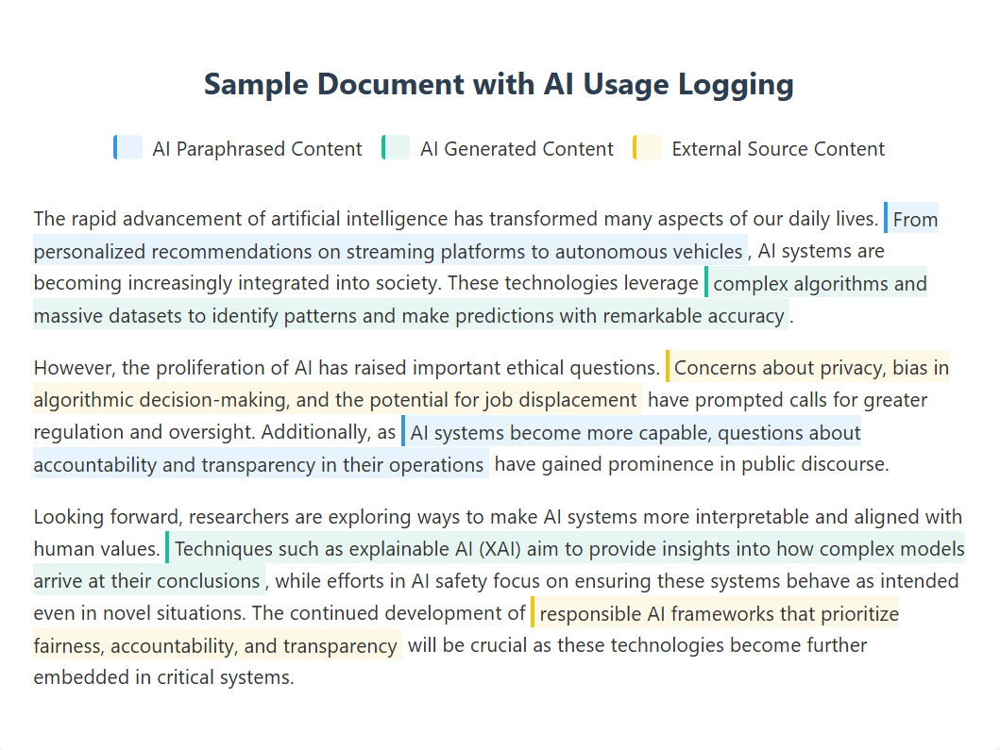

# Tracked Writing File Format (TWFF)

<div align="center">
  
  <br/><br/>
  <strong>An open standard for declaring AI use in writing.</strong><br/>
  Moving past probabilistic AI detection toward deterministic process transparency.
  <br/><br/>
  <a href="https://demo.firl.nl/">Live Demo</a> ·
  <a href="https://firl.nl/research/blog/Manifesto/">Read the Manifesto</a> ·
  <a href="./spec/SPEC.md">Spec v0.2</a> ·
  <a href="./glassbox/README.md">Glass Box</a> ·
  <a href="https://github.com/Functional-Intelligence-Research-Lab/colophon">Colophon (Chrome Extension)</a>
</div>

---

## What is TWFF?

TWFF is a ZIP-based container format that stores a written document alongside a deterministic audit trail of how it was produced, including AI interactions, paste events, revision history, and timing metadata.

The goal is a cryptographic record of the writing process that an author can voluntarily share to declare their AI usage.

> Unlike probabilistic AI detectors that guess authorship from final text, TWFF is the Glass Box alternative. It does not detect; it records.

---

## Why a Container Format?

Packaging content and metadata together (modelled on EPUB) enables a range of disclosure levels:

| Use Case | Components Shared | What It Enables |
| --- | --- | --- |
| Research & Analytics | JSON log only | Privacy-preserving studies of AI usage patterns |
| Verification & Audit | Full container | Cryptographic proof of work |
| Visualization | Content + JSON | Rich, annotated views of the writing process |
| Archival | Full container + assets | Complete record of the creative process |

---

## Design Principles

| Principle | Description |
| --- | --- |
| **Local-First** | All telemetry is generated and stored on the creator's machine. No third-party servers are involved unless the user chooses to share. |
| **Deterministic** | Events are recorded in real time, providing a complete, non-probabilistic audit trail. |
| **Privacy-Preserving** | Content is stored separately from process metadata. Users control what to share and with whom. |
| **Extensible** | The container format accommodates additional assets, transcripts, and cryptographic signatures. |
| **Open Standard** | TWFF is free to implement. No proprietary lock-in. |

---

## Repository Structure

```text
twff/
├── spec/                        # The open standard
│   ├── SPEC.md                  # Normative specification (v0.2)
│   ├── process-log.schema.json  # JSON Schema for process-log.json (v0.2)
│   ├── manifest.schema.json     # JSON Schema for manifest.xml
│   ├── validate_examples.py     # Schema validation script
│   └── v0.1/                    # Frozen v0.1 release
│   └── v0.2/                    # V0.2 archive
│
├── glassbox/                    # Reference implementation (Soon to be archived as a separate repo)
│   ├── README.md
│   ├── app.py
│   ├── requirements.txt
│   ├── components/
│   │   ├── editor.py            # NiceGUI WYSIWYG (UI only)
│   │   ├── layout.py            # Application shell
│   │   └── process_log.py       # TWFF session recording (framework-agnostic)
│   └── css/
│       └── theme.css
│
├── CODE_OF_CONDUCT.md
├── CONTRIBUTING.md
└── LICENSE
```

**Why are `spec/` and `glassbox/` separated?**

Glass Box is one implementation of the standard. They version independently. Future implementations, browser extensions, LMS plugins, CLI tools can simply use `process_log.py` directly without importing any UI code.

---

## Specification Overview

Full specification (v0.2): [`spec/SPEC.md`](./spec/SPEC.md)

Frozen v0.1 release: [`spec/v0.1/README.md`](./spec/v0.1/README.md)

### Container Structure

```
document.twff  (ZIP archive)
├── content/
│   ├── document.xhtml           # Primary written work (XHTML required)
│   ├── images/
│   └── assets/
│       └── references.bib
├── meta/
│   ├── process-log.json         # Core event log (REQUIRED)
│   ├── manifest.xml             # Container manifest (RECOMMENDED)
│   └── chat-transcript.json     # Full AI conversation history (OPTIONAL)
└── META-INF/
    └── signatures.xml           # Integrity verification (OPTIONAL)
```

### Process Log Example (v0.2)

```json
{
  "version": "0.2.0",
  "session_id": "3f2a1b4c-5d6e-7f8a-9b0c-1d2e3f4a5b6c",
  "user_id": "anon-7f3a2c1b9d4e",
  "start_time": "2026-02-16T09:00:00Z",
  "end_time": "2026-02-16T11:30:00Z",
  "content_source": "content/document.xhtml",
  "events": [
    {
      "type": "session_start",
      "timestamp": "2026-02-16T09:00:01Z",
      "_hash": "a3f1..."
    },
    {
      "type": "edit_block",
      "timestamp": "2026-02-16T09:01:15Z",
      "source": "human",
      "position_start": 0,
      "position_end": 280,
      "delta_words": 52,
      "_hash": "b7c2..."
    },
    {
      "type": "ai_interaction",
      "timestamp": "2026-02-16T09:10:45Z",
      "model": "openai/gpt-4o",
      "output_preview": "Subsequently, the implementation...",
      "position_start": 575,
      "position_end": 895,
      "acceptance": "partially_accepted",
      "ai_chars": 180,
      "_hash": "d4e9..."
    },
    {
      "type": "checkpoint",
      "timestamp": "2026-02-16T09:15:00Z",
      "char_count_total": 1240,
      "word_count_total": 214,
      "_hash": "f1a3..."
    },
    {
      "type": "session_end",
      "timestamp": "2026-02-16T11:30:00Z",
      "_hash": "9c5b..."
    }
  ],
  "_integrity": {
    "algorithm": "sha256",
    "chain_hash": "e3b0c44298fc1c149afb...",
    "event_count": 5
  }
}
```

### Event Types (v0.2)

| Type | Description | Key Fields |
| --- | --- | --- |
| `session_start` | Beginning of a writing session | — |
| `session_end` | End of session | — |
| `edit_block` | A discrete human or AI-driven edit | `source`, `position_start`, `position_end`, `delta_words` |
| `paste` | Text pasted from clipboard | `char_count`, `source`, `position_start`, `position_end` |
| `paste_link` | URL or internal asset link inserted | `url`, `link_scope`, `title`, `position` |
| `image_upload` | Image or binary asset inserted | `filename`, `file_type`, `position` |
| `ai_interaction` | User-initiated AI prompt and response | `model`, `model_version`, `output_preview`, `acceptance`, `ai_chars` |
| `ai_suggestion` | Passive inline AI autocomplete | `model`, `output_preview`, `acceptance` |
| `checkpoint` | Periodic document statistics snapshot | `char_count_total`, `word_count_total` |
| `focus_change` | Editor focus lost or regained *(reserved, v0.3)* | `direction`, `duration_ms` |
| `chat_interaction` | Multi-turn AI conversation *(reserved, v0.3)* | `message_count`, `message_preview`, `source_file` |

#### `edit_block.source` Values

| Value | Meaning |
| --- | --- |
| `human` | Directly typed by the author |
| `ai` | Inserted from an `ai_interaction` or `ai_suggestion`, a paired AI event must be present |
| `external` | Originated outside the document (clipboard paste, bulk import, drag-and-drop). A corresponding `paste`, `paste_link`, or `image_upload` event SHOULD also be present at the same timestamp |
| `unknown` | Source cannot be determined or was not specified |

#### `acceptance` Values (AI events)

| Value | Description |
| --- | --- |
| `fully_accepted` | Output used as-is |
| `partially_accepted` | Some output used, some discarded |
| `modified` | Output used but significantly rewritten by the author |
| `rejected` | Output discarded entirely |

#### `paste_link.link_scope` Values

| Value | Meaning | `url` format |
| --- | --- | --- |
| `external` | Points to a web resource or external document | Absolute URI (e.g. `https://example.com/paper.pdf`) |
| `internal` | Points to an asset within the TWFF container | Relative path (e.g. `content/images/figure1.png`) |

---

## What's New in v0.2

v0.2 introduces enhanced metadata, fine-grained event types, and a cryptographically-strong per-event hash chain.

- **Per-Event Hash Chain**: Each event now includes a `_hash` field forming a chain secured by the `session_id` as root. Any post-hoc modification to any event or its ordering is detectable.
- **New Event Types**: `edit_block`, `paste_link`, `image_upload`, and `ai_suggestion` provide finer-grained tracking of content origin.
- **Enhanced AI Events**: `context_window`, `content_before`, `content_after`, `ai_chars`, and `model_version` fields enable diff rendering and contribution-ratio calculations.
- **Checkpoint Counts Required**: `checkpoint` events now require at least one of `char_count_total` or `word_count_total` for analytical value.
- **Clarified `paste_link`**: Distinguishes external web citations from internal container assets via the `link_scope` field. Uses `uri-reference` format to accommodate relative internal paths alongside absolute external URIs.
- **`edit_block.source` Clarified**: `"external"` now has explicit semantics relative to clipboard `paste` events; `"unknown"` is reserved for cases where even the origin category cannot be determined.
- **`user_id` Semantics**: Documented as anonymous and rotatable by default, with a defined path for pseudonymous platform-account linking (e.g. Chrome extension → Google account hash) with user consent. Prepared for `dpv:pseudonymousID` mapping in v0.3.

---

## Integrity & Privacy

### Hash Chain

The `process-log.json` includes a `_integrity` block with a SHA-256 `chain_hash`. Each event carries a `_hash` chained from the previous event's hash, with the `session_id` as the chain root. Any post-hoc modification to the log, including reordering, inserting, or deleting events is detectable by replaying the chain.

### What TWFF Does Not Store

- Individual keystroke content (only aggregated character counts per edit block)
- Raw prompts or full AI responses (only metadata previews, truncated to 100 characters)
- Personally identifiable information beyond a user-generated, rotatable anonymous ID
- Screen recordings, mouse movements, or biometric data

### User Control

All data is generated and stored locally. The user decides:

- Whether to share the container at all
- Whether to share only the JSON log (for research) or the full container (for verification)
- Whether to rotate their anonymous user ID between sessions

---

## Implementations

| Implementation | Description | Status |
| --- | --- | --- |
| [Glass Box](./glassbox/) | Python / NiceGUI reference editor | Active |
| [Colophon](https://github.com/Functional-Intelligence-Research-Lab/colophon) | Chrome extension for Google Docs & Overleaf | In development |

---

## Roadmap

| Phase | Deliverables | Target |
| --- | --- | --- |
| **v0.1 Core** | Schema, Python reference implementation, basic visualizer | Q1 2026 ✓ |
| **v0.2 Enhanced** | Hash chain, fine-grained events, AI event enrichment | Q2 2026 ✓ |
| **v0.3 Privacy** | W3C DPV alignment, `focus_change` + `chat_interaction` full spec | Q3 2026 |
| **Tools** | Colophon (Google Docs + Overleaf), visualizer v2 | Q3 2026 |
| **Integration** | Canvas plugin, Moodle plugin, validator service | Q4 2026 |
| **Future** | Cryptographic signing (RSA key pairs), decentralised storage, multi-author support | Q1 2027+ |

### Current Status

- [x] Specification v0.1 (schema, event types, container structure)
- [x] Reference implementation, Glass Box editor (Python / NiceGUI)
- [x] SHA-256 per-event hash chain
- [x] Specification v0.2 (enhanced events, clarified semantics, DPV preparation)
- [x] Schema validation script (`spec/validate_examples.py`)
- [ ] Define how `process-log.json` interacts with `signatures.xml`
- [ ] [Colophon](https://github.com/Functional-Intelligence-Research-Lab/colophon) Chrome extension (Google Docs / Overleaf)
- [ ] TWFF visualizer (standalone)
- [ ] LMS integration (Canvas, Moodle)

---

## Contributing

See [`CONTRIBUTING.md`](./CONTRIBUTING.md). All contributions including specification feedback, implementation ports, tooling, and documentation are welcome .

## Code of Conduct

See [`CODE_OF_CONDUCT.md`](./CODE_OF_CONDUCT.md).

## License

[Apache 2.0](./LICENSE)
